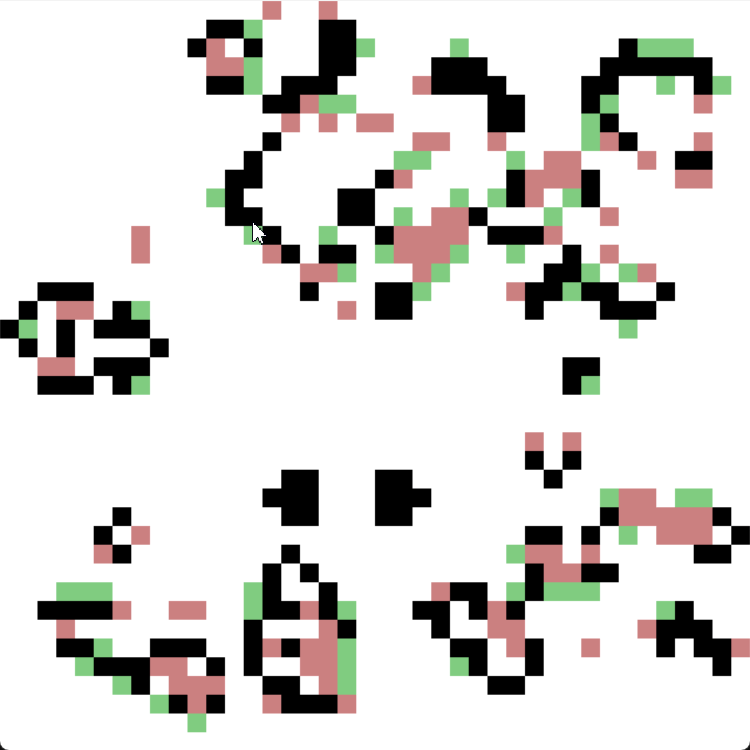

# Yampa - Game Of Life 

## This project is powered by SDL2 and OpenGL

You can change screen resolution and number of cells in [MainLoop.hs](./Rendering/MainLoop.hs).
Also game is capped at 30FPS, otherwise game defaults quite fast with smaller amounts of cells.

**Supports pausing with Space and mouse interaction.**

Main idea was to use Yampa and see what Functional Reactive Programming is about.

### Conclusion

With Yampa we can have a nice set of well defined behaviours. At first there was traditional implementation with game loop, but after transition to Yampa I saw nice performance boost. Program with 9000 (300x300) cells are using 170MB of memory at max. Concurrency shouldn't be hard to implement.